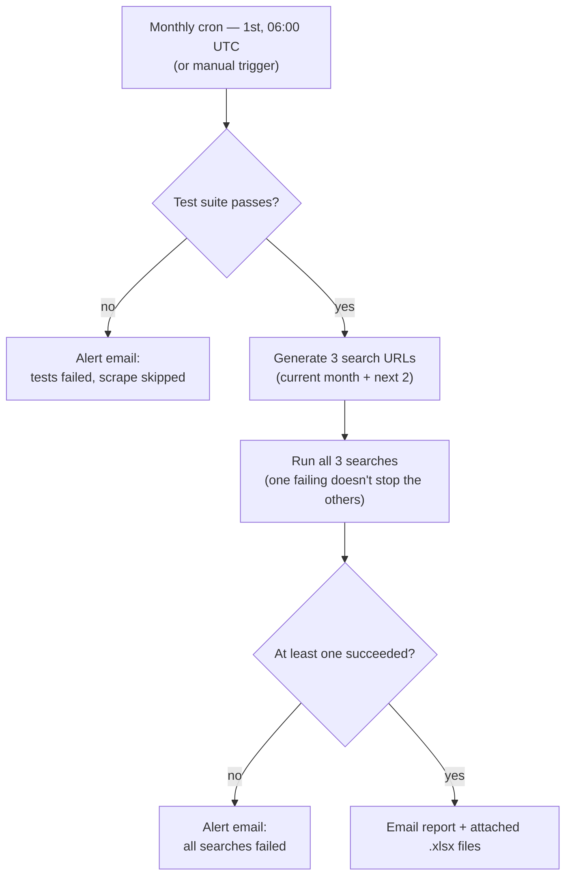

<div align="center">

# Hotel Data Scraper

**A modular, Playwright-based hotel search data collector — with anti-detection,
a real test suite, and a fully automated monthly run.**

[](https://www.python.org/)
[](https://docs.astral.sh/uv/)
[](https://playwright.dev/)
[](https://github.com/Sandro-Gogaladze/Hotel-Data-Scraper/actions/workflows/monthly-scrape.yml)

</div>

Built purely for personal research and educational purposes — not for commercial use.

Extracts hotel listing data from a search results page, then processes every hotel's
detail page in parallel to pull room-level pricing, cancellation policy, and breakfast
inclusion — exporting everything to a formatted Excel workbook. Runs on demand from the
CLI, or fully unattended on a monthly schedule with results emailed automatically.

## Contents

- [Features](#features)
- [Requirements](#requirements)
- [Quick start](#quick-start)
- [Repository structure](#repository-structure)
- [How it works](#how-it-works)
- [Configuration](#configuration)
- [Automated monthly run](#automated-monthly-run)
- [Testing](#testing)
- [Utilities](#utilities)
- [Anti-detection](#anti-detection)
- [Troubleshooting](#troubleshooting)
- [Ethical & legal considerations](#ethical--legal-considerations)

## Features

- **Two-phase scraping** — fast batched extraction of the search results page, then
  parallel per-hotel detail extraction using multiple worker processes.
- **Anti-detection** — user-agent rotation, stealth browser flags, randomized delays,
  staggered worker startup, per-worker fingerprint variation.
- **Excel export** — styled workbook with color-coded booleans, clickable hotel links,
  and a "Search Parameters" sheet parsed from the search URL.
- **Automated monthly run** — GitHub Actions runs a test gate, then 3 searches, then
  emails the results — no manual triggering required.
- **A test suite that takes site drift seriously** — fixture-based regression tests for
  fast feedback, plus a live test that actually hits the site to catch real markup
  changes before a scheduled run wastes hours on broken selectors.
- **Retry tooling** — re-run extraction for only the rows that failed in a previous run.
- **Failure analysis** — scans the day's log and asks GPT to summarize what broke.

## Requirements

- Python 3.11+
- [uv](https://docs.astral.sh/uv/) for dependency management
- An OpenAI API key (optional — only needed for breakfast-inclusion analysis and the
  failure analyzer; the scraper itself runs fine without one)

## Quick start

```bash
# Install dependencies (creates .venv automatically)
uv sync

# Install the Chromium browser Playwright needs
uv run playwright install chromium

# Optional: enable breakfast-inclusion analysis
cp .env.example .env
# then edit .env and set OPENAI_API_KEY

# Run the scraper
uv run python main.py
```

You'll be prompted for a hotel search results URL from the target site. Results are
saved as a timestamped `.xlsx` file in `Booking_Data/`.

That's really it for normal use — if you've just cloned this to run a search, `uv sync`,
install Chromium, run `main.py`, paste a URL. Everything below about scheduling, secrets,
and config tuning describes how *I* run this on a recurring basis; you don't need any of
it just to do a one-off search.

## Repository structure

```text
main.py                        CLI entry point — prompts for a URL, drives one run

scraper/
├── coordinator.py             Orchestrates phase 1 → phase 2
├── search_page/
│   ├── basic_extractor.py     Loads the search page, scrolls/paginates
│   ├── extractor.py           Per-card + batched JS extraction (name, price, reviews…)
│   └── locators.py            CSS selectors for the search results page
└── hotel_page/
    ├── process_based_extractor.py   Worker processes, queue-based hotel distribution
    ├── detailed_extractor.py        Navigates a hotel page, extracts rooms, prices
    └── locators.py                  CSS/JS selectors for the hotel detail page

browser/
├── core.py                    Page creation with stealth config + resource blocking
└── navigation.py               Scrolling, "load more" clicking, wait helpers

utils/
├── anti_detection.py          User-agent rotation, launch options, stealth scripts
├── helpers.py                  Safe element extraction, price cleaning
├── url_parser.py                Parses search parameters out of the search URL
└── logger.py                    File + console logging

export/excel.py               Styled .xlsx export
analyzers/breakfast.py        GPT-based "is breakfast actually free" classifier
config.py                     All tunables — workers, timeouts, delays, output dirs

retry_failed_hotels.py        Standalone: re-scrape only the failed rows in a workbook
fail_analyzer.py              Standalone: GPT summary of today's extraction failures

scheduled/                    Everything the automated monthly run needs
├── search_recipe.json        Destination + filters (edit this to change what's searched)
├── url_generator.py          Builds this run's 3 URLs from the recipe + today's date
├── run_batch.py                Non-interactive: runs all 3 searches, tolerates 1 failing
├── email_template.json        Subject / greeting / closing text for the report email
└── send_report.py             Emails results, or an alert if the test gate failed

.github/workflows/
└── monthly-scrape.yml        Scheduled job: test gate → batch scrape → email

tests/                        Unit tests, fixture-based regression tests, live smoke test
```

## How it works

1. **Phase 1 — search page:** load the search URL, scroll / click "Load more" until all
   property cards are loaded, batch-extract name / link / address / price / review / star
   data in a single JS pass.
2. **Phase 2 — hotel pages:** distribute hotels across `MAX_WORKERS` worker processes
   (each with its own browser + one reused page), extract room rows per hotel, compute
   min price, min 2-person price, free cancellation, non-refundable, breakfast included.
3. **Export:** write everything to a styled Excel workbook, with an "Execution Error"
   column flagging rows that failed extraction.

## Configuration

Tunables (worker count, timeouts, delays, output paths) live in [`config.py`](config.py)
as plain constants — that's just how I've tuned this for my own use, and you don't need
to touch it to run a search. The one exception is `HEADLESS`, which also accepts an env
var override (`HEADLESS=true`) for environments with no display, like CI — that's what
the automated run below relies on.

`.env` only needs `OPENAI_API_KEY` (see `.env.example`), and only if you want
breakfast-inclusion analysis.

## Automated monthly run

This is how I actually run this day to day: every month I check hotel prices for the
current month plus the next two, to see how they move as the dates get closer. A GitHub
Actions workflow ([`.github/workflows/monthly-scrape.yml`](.github/workflows/monthly-scrape.yml))
does that for me automatically — test gate, then scrape, then email — so I don't have to
remember to kick it off by hand:



> [!NOTE]
> The test gate runs *before* any scraping. If it fails, nothing is scraped that
> month — you get an alert email instead, so a broken scraper never fails silently.

Configuration for what gets searched and how results get emailed lives in `scheduled/`
(`search_recipe.json`, `email_template.json`) — again, that's specific to how I use this
and not something you need to touch just to run the scraper yourself.

You can trigger the real workflow on demand from the **Actions** tab on GitHub (it has a
`workflow_dispatch` trigger) instead of waiting for the 1st of the month.

> [!WARNING]
> The default recipe searches **all of Georgia** (`dest_type=country`), which returns far
> more hotels than a single-city search — this repo's own local test runs against a single
> town returned dozens to low hundreds of hotels; a whole-country search is plausibly much
> larger. Watch the first couple of scheduled/manual runs in the Actions tab to see actual
> timing before trusting the monthly schedule unattended, and narrow
> `search_recipe.json`'s filters (e.g. add a price or star-rating filter) if a run turns
> out to take multiple hours.

## Testing

The target site's DOM changes without notice, so the test suite is split into two layers:

```bash
uv run pytest              # fast: unit tests + fixture-based selector regression tests
uv run pytest -m live      # slow, opt-in: hits the real site to check selectors are still valid
```

- **Unit tests** (`tests/test_helpers.py`, `test_url_parser.py`, `test_anti_detection.py`,
  `test_config_headless.py`, `test_url_generator.py`, `test_run_batch.py`,
  `test_send_report.py`) cover pure logic with no browser involved.
- **Fixture-based regression tests** (`tests/test_search_page_extraction.py`,
  `tests/test_hotel_page_extraction.py`) load saved local HTML snapshots into a real
  headless Chromium page and run the actual extraction functions against them. These
  catch regressions in *our* code but won't detect drift on the live site, since the
  fixtures are static.
- **Live smoke test** (`tests/test_live_smoke.py`, marked `@pytest.mark.live`, skipped by
  default) hits the real site and asserts the selectors still resolve. This is the one
  that actually catches "the site changed its markup," and it's the same test that gates
  the automated monthly run.

If the live test fails, refresh the fixtures from a real page and diff:

```bash
uv run python tests/refresh_fixtures.py "<a real search results URL>" "<a real hotel URL>"
```

then update `scraper/*/locators.py` and the extraction JS to match what changed.

## Utilities

**Retry failed hotels** — if a run finishes with rows flagged `Execution Error = True`:

```bash
uv run python retry_failed_hotels.py                 # defaults to the newest file in Booking_Data/
uv run python retry_failed_hotels.py path/to/file.xlsx --max-retries 4
```

**Analyze failures** — scans the most recent scraping session in `logs/` and asks GPT to
summarize failure patterns and likely causes:

```bash
uv run python fail_analyzer.py
```

## Anti-detection

- 5 rotating desktop user agents (Chrome/Firefox/Safari/Edge)
- Stealth init scripts (hides `navigator.webdriver`, spoofs plugins/languages)
- Randomized delays between actions and staggered worker startup (`worker_id * 2s`)
- Per-worker Chromium flag variation (image loading, logging, plugins) to diversify
  fingerprints across parallel workers

None of this guarantees you won't get blocked — if you do, reduce `MAX_WORKERS` and
increase delays in `config.py`.

## Troubleshooting

**Browser not installed:**

```bash
uv run playwright install chromium
```

**No hotels found / extraction failing across the board:** the target site likely
changed its markup. Run the live test (`uv run pytest -m live`) to confirm, then refresh
fixtures and update locators as described in [Testing](#testing).

**Debugging a specific run:** set `HEADLESS = False` in `config.py` to watch the browser,
or `LOG_LEVEL = logging.DEBUG` for verbose logs in `logs/scraper_<date>.log`.

## Ethical & legal considerations

> [!IMPORTANT]
> This tool is strictly for personal research and educational purposes. It is **not**
> intended for commercial use of any kind, it is **not** legal advice, and the author is
> not responsible for how it's used.

Automated data extraction from a commercial website sits in genuinely contested
territory, not a settled one. Before relying on this for anything beyond personal
experimentation, be aware of the following:

- **Terms of Service.** The target site's Terms of Service very likely prohibit automated
  scraping. Violating a site's ToS is a contractual issue, separate from whether the
  scraping itself is "legal" in a criminal sense — consequences can range from an IP
  block up to a cease-and-desist, depending on scale and use.
- **robots.txt is not checked.** This scraper does not read or respect robots.txt. If
  your use case requires that kind of compliance, verify it yourself before running this.
- **Server load.** The anti-detection delays here exist partly to look human, but running
  this at scale still places real load on the target site's infrastructure. Keep worker
  counts and run frequency reasonable — don't scrape more often or more broadly than you
  actually need.
- **What you do with the data matters as much as the scraping.** Personal, non-commercial,
  one-off research carries different (and lower) risk than republishing, reselling, or
  commercially using the scraped data.
- **Institutional or organizational use.** If this is running on behalf of an
  organization rather than as personal exploration, get sign-off from legal/compliance
  before relying on it — don't treat this README as clearance to do so.

If in doubt: keep it low-frequency, personal and non-commercial, and be ready to stop
immediately if the target site ever objects.
